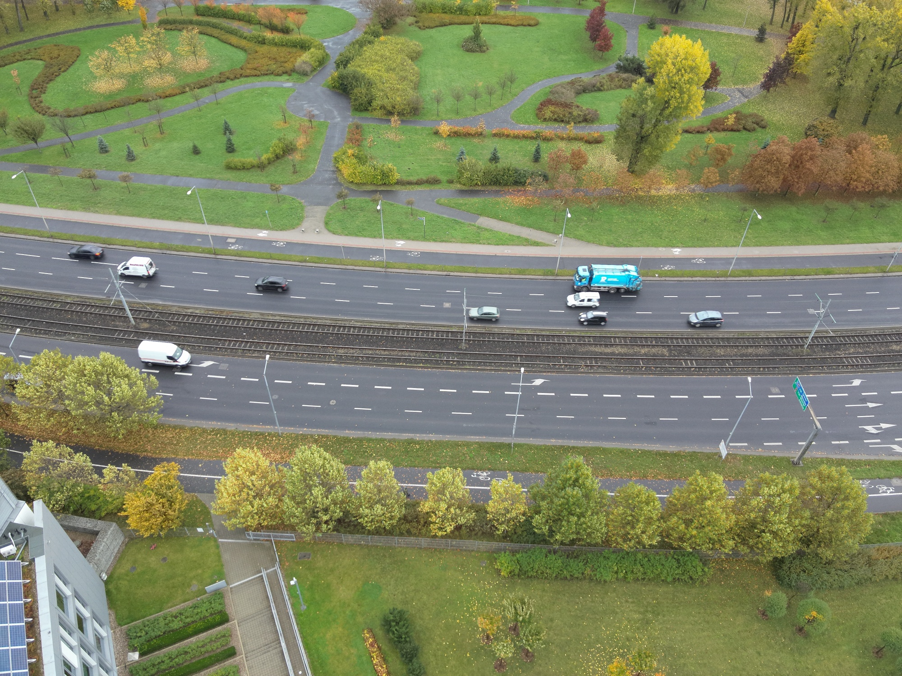
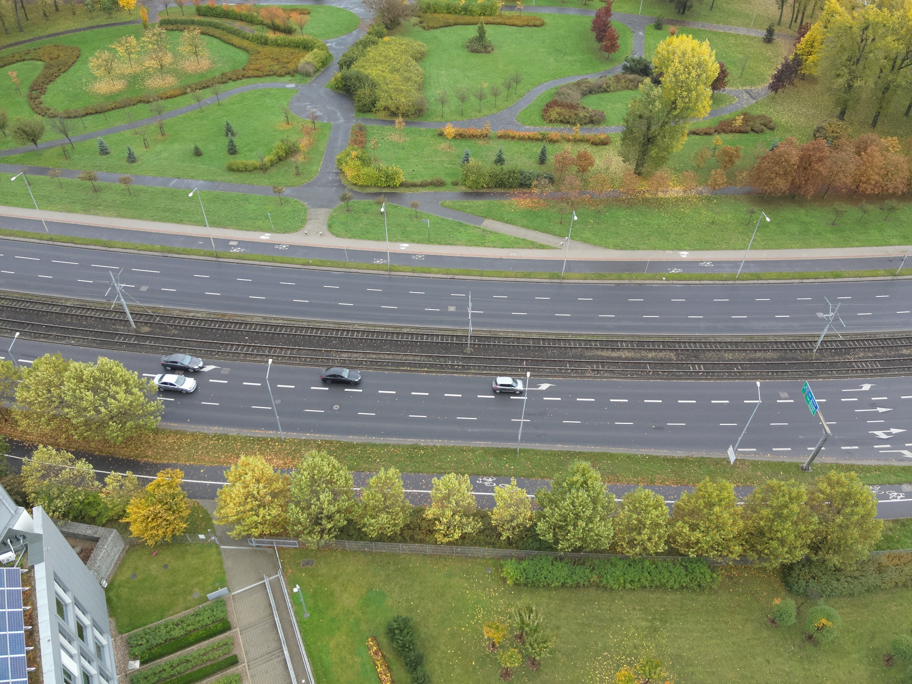
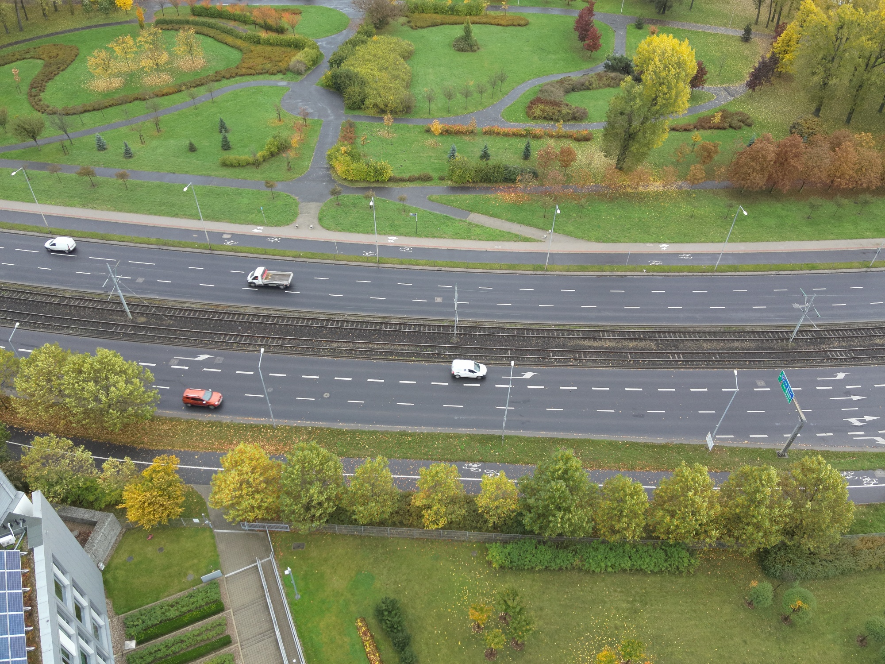

# car-removal-compvision

The task lies in combining source images of a road into one without any cars (a "clean slate") **without the use deep learning methods** - only using classical Computer Vision.

### Source Images
   

### Resulting Image with Removed Cards

